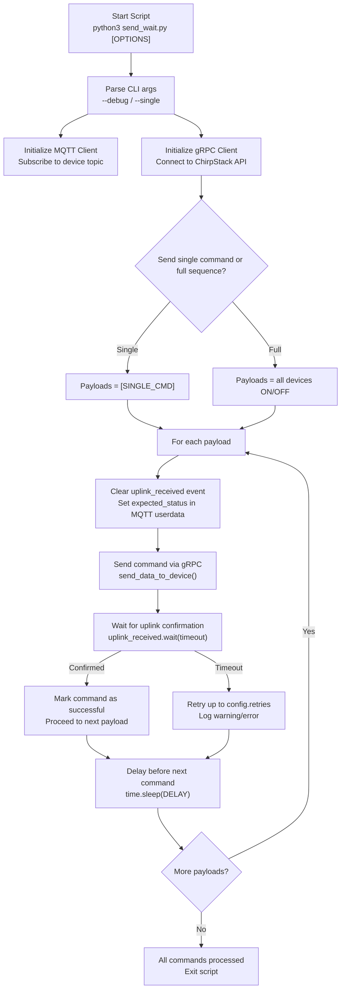

# LoRaWAN Send-Wait Script Documentation

## Command-Line Usage

```bash
# Send all commands with debug
python3 send_wait.py --debug

# Send a single command without debug
python3 send_wait.py --single "R:1:ON"

# Send a single command with debug
python3 send_wait.py --single "X:3:OFF" --debug
```

## Command-Line Options
| Option        | Description                                                  |
|---------------|--------------------------------------------------------------|
| `-d, --debug` | Enable debug output to terminal                              |
| `-s, --single`| Send a single command instead of the full list. Format: "R:1:ON" |


## Script Behavior
	•	Connects to the ChirpStack gRPC server to queue LoRaWAN commands.
	•	Starts a background MQTT client to listen for uplink confirmations.
	•	For each command:
	•	Sends command via gRPC.
	•	Waits for MQTT uplink confirmation (TIMEOUT seconds).
	•	Retries up to config.retries times if no confirmation.
	•	Logs warnings and errors in lorawan_errors.log.
	•	Respects DELAY between commands to avoid saturating the LoRaWAN network.
	•	Can operate on all devices (default) or a single device (--single).



## Examples of CLI Usage
| Example Command                                | Description                                         |
|-----------------------------------------------|----------------------------------------------------|
| `python3 send_wait.py`                        | Send all devices ON/OFF sequence, no debug        |
| `python3 send_wait.py --debug`                | Send all devices with debug output                 |
| `python3 send_wait.py --single "R:1:ON"`     | Send only the command R:1:ON, silent mode         |
| `python3 send_wait.py --single "L:R:OFF" --debug` | Send a single command with debug output         |

## MQTT / gRPC Notes

	•	MQTT Broker: from credentials.py
	•	MQTT Topic template: application/+/device/<dev_eui>/event/#
	•	gRPC Server: configured via credentials.py
	•	Device EUI: from credentials.py
	•	Timeouts: controlled by config.timeout (seconds)
	•	Retries: controlled by config.retries and config.retry_delay
	•	Delay between commands: config.delay

## Logging
	•	All errors and warnings are logged to lorawan_errors.log.
	•	Only debug messages print to terminal when --debug is set.
	•	Ensures silent operation when script is called from other automation scripts.

## Notes
	•	--single allows integration with other scripts for targeted control.
	•	Script respects LoRaWAN network load by using delays and retries.
	•	The feedback loop ensures that commands are confirmed by the device uplink before proceeding.